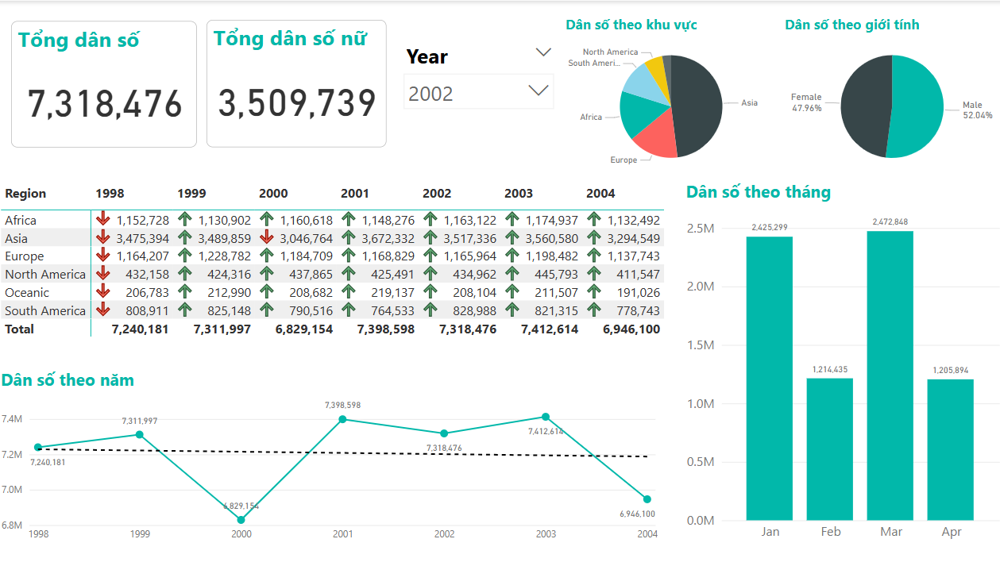

# 🌍 Population Insight Dashboard – Power BI

This project is an interactive Power BI dashboard that visualizes global population trends over time. It allows users to explore insights based on year, region, gender, and time distribution.

---

## 📊 Features

- **Total Population & Female Population** by year
- **Yearly growth trends** across six world regions
- **Gender distribution** (Male vs Female)
- **Population breakdown by month**
- **Pie chart visualizations** for intuitive insights
- Fully **interactive slicers** for filtering by year

---

## 📂 Files Included

| `Final.pbix` | Power BI file with fully built dashboard |
| `PowerBI-preview.png` | Image preview of the dashboard |
| `population_data.xlsx` *(optional)* | Source dataset used in the dashboard |

---

## 🛠 Tools & Skills Applied

- Power BI Desktop
- DAX basics
- Data cleaning & modeling
- KPI cards, pie charts, line and bar charts
- Interactive slicers

---

## 🚀 How to Use

1. Download or clone this repository
2. Open the `.pbix` file with Power BI Desktop
3. Use the slicers and visuals to explore the data
4. *(Optional)* Load the Excel dataset to rebuild the report from scratch
